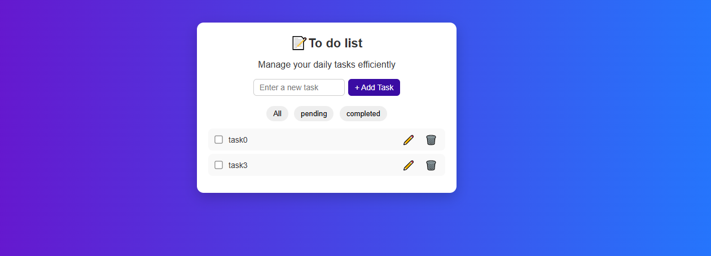

## 📸 Screenshots

### 1 No Task Available

When the app is first opened and no task has been added yet, a message appears:

> **No task added**

### 2 Add a Task

Type a task into the input field and click "**+ Add Task**".  
The task will be added to your list.

### 3 Edit a Task

To update a task, click the ✏️ **Edit** icon beside it.  
A popup will let you change the task text.

  

### 4 Delete a Task

Click the 🗑️ **Delete** icon beside any task to remove it.

### 5 Complete a Task

Click the checkbox beside a task to mark it as **completed**.  
Completed tasks appear with a line-through style or a different color (depending on your design).

## Technologies Used

- HTML5
- CSS3
- JavaScript
## Author
 Fenet Damena